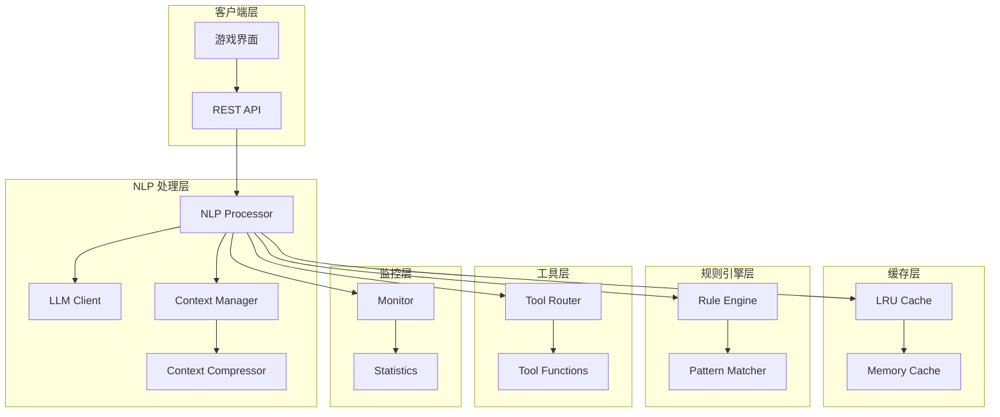
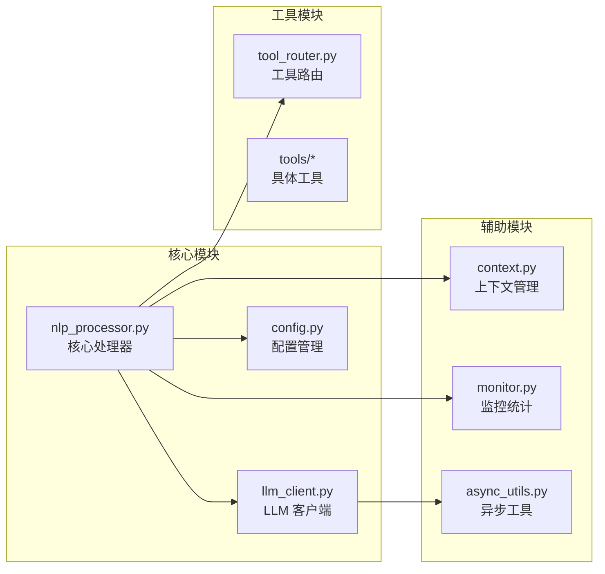
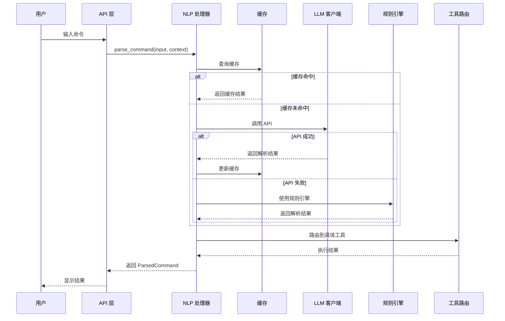
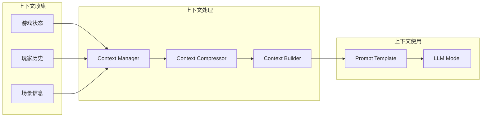
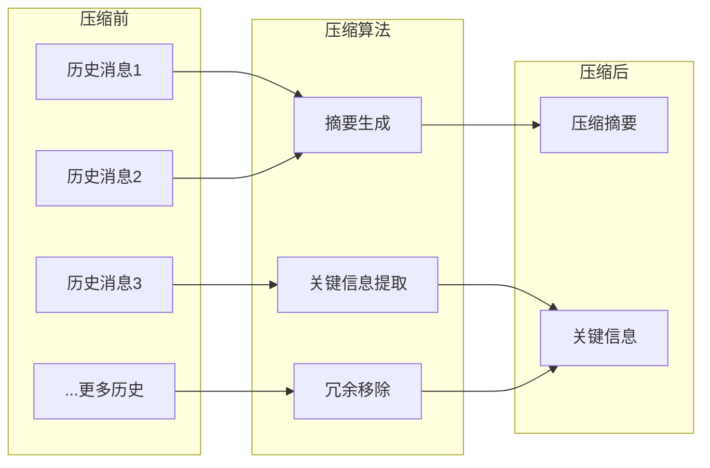

# NLP 架构文档

## 目录

- [系统概述](#系统概述)
- [架构设计](#架构设计)
- [组件详解](#组件详解)
- [数据流](#数据流)
- [技术决策](#技术决策)
- [扩展性设计](#扩展性设计)
- [性能优化](#性能优化)

## 系统概述

修仙世界引擎的 NLP 系统是一个模块化、可扩展的自然语言处理架构，旨在提供智能、高效的玩家命令解析功能。系统采用了分层架构设计，将核心功能解耦，便于维护和扩展。

### 设计目标

1. **智能理解**: 准确理解玩家的自然语言输入
2. **高性能**: 通过缓存和异步处理优化响应速度
3. **高可用**: 提供完善的错误处理和回退机制
4. **可扩展**: 支持多种 LLM 提供商和自定义工具
5. **易维护**: 清晰的模块划分和接口设计

## 架构设计

### 整体架构图



### 模块划分



## 组件详解

### 1. NLP Processor (核心处理器)

**职责：**
- 接收和预处理用户输入
- 协调各子系统完成命令解析
- 管理缓存策略
- 处理错误和回退逻辑

**关键方法：**
```python
class DeepSeekNLPProcessor:
    def parse_command(self, raw_input: str, context: Dict) -> ParsedCommand
    def parse_command_async(self, raw_input: str, context: Dict) -> ParsedCommand
    def _build_prompt(self, raw_input: str, context: Dict) -> str
    def _parse_llm_response(self, response: str) -> ParsedCommand
```

### 2. LLM Client (语言模型客户端)

**职责：**
- 管理与 LLM API 的通信
- 实现重试和超时机制
- 支持多种 LLM 提供商
- 处理 API 认证和错误

**支持的提供商：**
- DeepSeek
- OpenAI
- Mock (用于测试)

### 3. Context Manager (上下文管理器)

**职责：**
- 收集游戏状态信息
- 构建命令解析上下文
- 管理历史对话记录
- 实现上下文压缩

### 4. Tool Router (工具路由器)

**职责：**
- 注册和管理游戏动作
- 路由解析结果到具体实现
- 提供工具发现机制

### 5. Monitor (监控组件)

**职责：**
- 收集运行时统计数据
- 监控 API 调用情况
- 跟踪缓存命中率
- 生成性能报告

## 数据流

### 命令处理流程



### 上下文处理流程



## 技术决策

### 1. 异步处理

**决策：** 提供同步和异步两种 API

**原因：**
- 支持高并发场景
- 不阻塞游戏主循环
- 提高用户体验

**实现：**
```python
# 同步方式
result = nlp.parse_command("攻击")

# 异步方式
result = await nlp.parse_command_async("攻击")
```

### 2. 缓存策略

**决策：** 使用 LRU 缓存 + 内存缓存

**原因：**
- 减少 API 调用成本
- 提高响应速度
- 平衡内存使用

**配置：**
- 默认缓存大小：128 条
- 缓存键：命令 + 上下文哈希
- 过期策略：LRU (最近最少使用)

### 3. 错误处理

**决策：** 多级回退机制

**回退顺序：**
1. LLM API 解析
2. 规则引擎解析
3. 模糊匹配
4. 返回错误提示

### 4. 模型选择

**决策：** 默认使用 DeepSeek，支持多模型

**原因：**
- DeepSeek 在中文理解上表现优秀
- 成本效益高
- 支持切换到其他模型

## 扩展性设计

### 1. 添加新的 LLM 提供商

```python
class NewLLMProvider(BaseLLMClient):
    def __init__(self, api_key: str):
        self.api_key = api_key
    
    async def complete(self, prompt: str) -> str:
        # 实现 API 调用
        pass
```

### 2. 注册新的工具

```python
@register_tool("new_action")
def new_action(payload: Dict[str, Any]) -> Dict[str, Any]:
    # 实现新功能
    return {"result": "success"}
```

### 3. 自定义上下文处理

```python
class CustomContextBuilder(BaseContextBuilder):
    def build(self, game_state: GameState) -> Dict[str, Any]:
        # 自定义上下文构建逻辑
        pass
```

## 性能优化

### 1. 缓存优化

- **智能缓存键生成**: 基于命令和关键上下文
- **预热机制**: 启动时加载常用命令
- **分级缓存**: 内存缓存 + 持久化缓存

### 2. 并发优化

- **连接池**: 复用 HTTP 连接
- **批处理**: 合并相似请求
- **异步 I/O**: 非阻塞处理

### 3. 上下文压缩



### 4. 监控和调优

- **实时监控**: API 延迟、缓存命中率
- **性能分析**: 瓶颈识别和优化
- **自动调整**: 根据负载动态调整参数

## 安全考虑

### 1. API 密钥管理

- 使用环境变量存储
- 支持密钥轮换
- 加密传输

### 2. 输入验证

- 长度限制
- 内容过滤
- 注入防护

### 3. 速率限制

- 用户级别限流
- API 调用限流
- 自动降级保护

## 未来规划

### 短期目标

1. 支持更多 LLM 提供商
2. 优化上下文压缩算法
3. 增强错误恢复能力

### 长期目标

1. 本地模型支持
2. 多语言支持
3. 自适应学习能力
4. 分布式部署支持

## 最佳实践

### 1. 配置建议

```json
{
  "cache_size": 256,        // 适中的缓存大小
  "timeout": 30,            // 合理的超时时间
  "retry_count": 3,         // 重试次数
  "temperature": 0.7        // 平衡创造性和准确性
}
```

### 2. 监控指标

- API 响应时间 < 500ms
- 缓存命中率 > 70%
- 错误率 < 1%
- 回退使用率 < 10%

### 3. 开发建议

- 始终提供有意义的上下文
- 合理使用异步 API
- 实现优雅降级
- 定期清理缓存