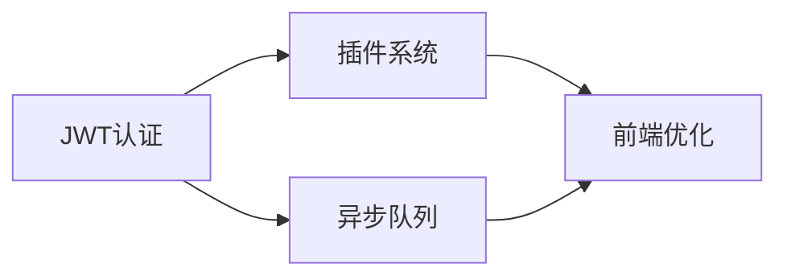

# 第4阶段 Batch-2 实施计划

基于代码审计反馈，制定第二批功能增强计划（25% → 50%）

## 🎯 目标：可扩展性与插件化

### 1. 模块化插件系统 (预计工作量：5天)

**核心功能**：
- 插件自动发现机制（基于 `pkg_resources` / `importlib.metadata`）
- 标准化插件接口（IPlugin）
- 插件生命周期管理（加载、启用、禁用、卸载）
- 插件依赖解析

**实现要点**：
```python
# plugins/interface.py
class IPlugin(ABC):
    """插件基础接口"""
    @property
    @abstractmethod
    def name(self) -> str: pass

    @property
    @abstractmethod
    def version(self) -> str: pass

    @abstractmethod
    def on_load(self, container: ServiceContainer): pass

    @abstractmethod
    def on_enable(self): pass

    @abstractmethod
    def on_disable(self): pass

# plugins/manager.py
class PluginManager:
    """插件管理器"""
    def discover_plugins(self) -> List[IPlugin]:
        """从指定目录/包发现插件"""
        pass

    def load_plugin(self, plugin_path: str) -> IPlugin:
        """动态加载插件"""
        pass
```

**示例插件**：
- 新地图区域插件
- 自定义功法系统
- 特殊事件生成器

### 2. JWT认证与RBAC权限系统 (预计工作量：3天)

**核心功能**：
- JWT token生成与验证
- 角色定义（Player、GM、Admin、Developer）
- 权限装饰器
- Token刷新机制

**实现要点**：
```python
# auth/jwt_manager.py
from flask_jwt_extended import JWTManager, create_access_token

# auth/decorators.py
@require_role('admin')
def admin_only_endpoint():
    pass

# 权限矩阵
PERMISSIONS = {
    'player': ['game.*', 'save.*'],
    'gm': ['game.*', 'save.*', 'player.view'],
    'admin': ['*'],
    'developer': ['*', 'dev.*']
}
```

### 3. 异步任务队列 (预计工作量：4天)

**核心功能**：
- Celery集成（或轻量级RQ）
- 任务调度器
- 任务状态追踪
- 任务结果存储

**任务类型**：
```python
# tasks/game_tasks.py
@celery.task
def batch_event_simulation(event_data):
    """批量事件模拟"""
    pass

@celery.task
def generate_world_events():
    """生成世界事件"""
    pass

@celery.task
def cleanup_old_logs():
    """清理过期日志"""
    pass
```

**监控指标**：
- `task_duration_seconds{task_name, status}`
- `task_queue_length{queue_name}`
- `task_failures_total{task_name}`

### 4. 前端构建优化 (预计工作量：2天)

**核心功能**：
- Vite/ESBuild集成
- 模块拆分与懒加载
- Source map生成
- 资源哈希与CDN支持

**构建配置**：
```javascript
// vite.config.js
export default {
  build: {
    rollupOptions: {
      output: {
        manualChunks: {
          'vendor': ['vue', 'axios'],
          'game-core': ['./src/game/*.js'],
          'ui-components': ['./src/components/*.js']
        }
      }
    }
  }
}
```

## 📋 实施顺序与依赖



1. **第一周**：JWT认证系统（基础安全）
2. **第二周**：插件系统（核心扩展性）
3. **第三周**：异步队列（性能优化）
4. **第四周**：前端构建（用户体验）

## 🔧 技术选型理由

| 组件 | 选择 | 理由 |
|------|------|------|
| 认证 | Flask-JWT-Extended | 成熟、文档完善、社区活跃 |
| 队列 | Celery + Redis | 功能完整、支持多种broker |
| 插件 | 自研 + stevedore | 灵活性高、符合项目需求 |
| 构建 | Vite | 快速、现代、Vue生态友好 |

## 🚦 验收标准

### 插件系统
- [ ] 能够热加载/卸载插件
- [ ] 插件间依赖自动解析
- [ ] 提供至少2个示例插件
- [ ] 插件API文档完整

### 认证系统
- [ ] JWT token有效期管理
- [ ] 角色权限正确隔离
- [ ] 支持token刷新
- [ ] 防重放攻击

### 任务队列
- [ ] 支持定时任务
- [ ] 任务失败重试
- [ ] 死信队列处理
- [ ] 监控面板集成

### 前端构建
- [ ] 首屏加载 < 3秒
- [ ] 代码分割合理
- [ ] 缓存策略有效
- [ ] 支持增量更新

## 💡 风险与缓解

| 风险 | 影响 | 缓解措施 |
|------|------|----------|
| 插件恶意代码 | 高 | 沙箱执行、代码审查 |
| JWT密钥泄露 | 高 | 密钥轮转、HSM存储 |
| 任务堆积 | 中 | 队列监控、自动扩容 |
| 构建时间过长 | 低 | 增量构建、并行处理 |

## 📊 预期收益

1. **可扩展性提升**
   - 第三方开发者可贡献插件
   - 功能模块解耦
   - 降低核心代码复杂度

2. **安全性增强**
   - 细粒度权限控制
   - API访问审计
   - 敏感操作保护

3. **性能优化**
   - 长任务异步处理
   - 前端加载提速50%
   - 服务器资源利用率提升

4. **开发效率**
   - 插件独立开发测试
   - 前端热更新
   - 任务调试便利

## 🗓️ 时间线

- **2025-07-01**：Batch-2 启动
- **2025-07-07**：JWT认证完成
- **2025-07-14**：插件系统完成
- **2025-07-21**：异步队列完成
- **2025-07-28**：前端优化完成
- **2025-07-31**：Batch-2 验收

## 📝 交付物清单

1. **代码**
   - [ ] `xwe/plugins/` - 插件系统
   - [ ] `xwe/auth/` - 认证模块
   - [ ] `xwe/tasks/` - 异步任务
   - [ ] `frontend/build/` - 构建配置

2. **文档**
   - [ ] 插件开发指南
   - [ ] API认证说明
   - [ ] 任务队列使用手册
   - [ ] 前端架构文档

3. **测试**
   - [ ] 插件加载测试
   - [ ] 权限测试矩阵
   - [ ] 任务性能测试
   - [ ] 前端E2E测试

4. **示例**
   - [ ] 2个完整插件
   - [ ] 认证集成示例
   - [ ] 任务定义示例
   - [ ] 前端组件示例

---

**注意**：此计划基于当前资源和优先级制定，可根据实际情况调整。
